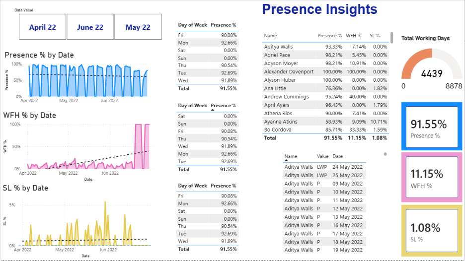

<div align="center">

# Presence Insights | HR Attendance Analytics Dashboard

**A Power BI dashboard that analyzes employee presence, work-from-home patterns, and sick leave trends to support data-driven HR decisions.**

[](https://powerbi.microsoft.com/)
[](https://www.microsoft.com/excel)
[](dax-measures.md)
[](LICENSE)

</div>

---

## 📸 Dashboard Preview



---

## 📋 Project Summary

HR teams often track employee attendance in scattered Excel sheets — one sheet per month, one column per day. This makes it difficult to spot absenteeism patterns, measure hybrid-work adoption, or report workforce availability to leadership.

This project solves that problem by building an **interactive Power BI dashboard** that consolidates three months of raw attendance data (April–June 2022) into a single, filterable report with clear KPIs and visual trends.

---

## 🎯 Business Objective

- Provide a **single-view attendance report** for HR managers and leadership
- Track **office presence, WFH usage, and sick leave** at both the organizational and individual level
- Identify **weekday patterns and monthly trends** to support policy and facility planning
- Enable **employee-level drill-down** for performance reviews and follow-up conversations

---

## 🛠️ Tools & Technologies

| Tool | Role |
|---|---|
| **Power BI Desktop** | Dashboard design and interactive reporting |
| **Power Query** | Data cleaning, transformation, and merging |
| **DAX** | Calculated measures for KPIs and percentages |
| **Microsoft Excel** | Source data (monthly attendance sheets) |

---

## 🔄 Project Workflow

```
Excel Data (3 monthly sheets)
        ↓
Power Query — clean, unpivot, merge into one table
        ↓
DAX Measures — Presence %, WFH %, SL %, Total Working Days
        ↓
Power BI Dashboard — KPI cards, trend charts, slicers, employee matrix
```

1. **Data Collection** — Raw attendance data in Excel with separate sheets for April, May, and June 2022
2. **Data Transformation** — Used Power Query to unpivot date columns, normalize attendance codes, clean data types, and merge all months into one table
3. **Measure Creation** — Built DAX measures for core counts (Present Days, WFH Count, SL Count) and derived percentages using `DIVIDE()` for safe division
4. **Dashboard Design** — Created an interactive single-page report with KPI cards, trend lines, day-of-week tables, employee breakdown matrix, and month slicers

---

## 📊 Dashboard Features

| Feature | What It Shows |
|---|---|
| **KPI Cards** | Presence % · WFH % · SL % at a glance |
| **Total Working Days Gauge** | 4,439 working days tracked across all employees |
| **Month Slicers** | Filter by April 22, May 22, or June 22 |
| **Trend Charts** | Presence %, WFH %, and SL % plotted by date |
| **Day-of-Week Table** | Attendance % for each weekday (Mon–Fri) |
| **Employee Matrix** | Individual Presence %, WFH %, and SL % per employee |
| **Detail Table** | Raw attendance records — Name, Status Code, Date |

---

## 📈 KPI Summary

| KPI | Value | What It Means |
|:---|:---:|:---|
| **Presence %** | 91.55% | Employees were in-office on ~92 out of every 100 working days |
| **WFH %** | 11.15% | About 1 in 9 working days were spent working from home |
| **SL %** | 1.08% | Sick leave was minimal — roughly 1 day per 100 working days |
| **Total Working Days** | 4,439 | Aggregate working days tracked (excludes weekends and holidays) |

---

## 💡 Key Business Insights

1. **Strong office attendance at 91.55%** — The workforce maintains a healthy in-office presence, suggesting that current attendance policies are effective and office infrastructure is being well-utilized.

2. **WFH at 11.15% reflects a controlled hybrid model** — Remote work is available but not the default. This rate is consistent across the three months, indicating a stable and managed hybrid arrangement rather than ad-hoc remote usage.

3. **Sick leave at 1.08% is well below industry benchmarks** — Unplanned health absences are minimal, which points to generally good employee well-being. Any sudden spikes in SL % by month or individual would be worth investigating.

4. **Friday shows the lowest office presence (90.08%)** — Compared to Tuesday (92.69%), Fridays see a noticeable attendance dip. HR can use this pattern to schedule important in-person activities early in the week and plan lighter facility usage on Fridays.

5. **Employee-level analysis reveals outliers** — While most employees maintain 90%+ presence, a few individuals show high WFH or SL percentages. This data supports targeted, evidence-based conversations during reviews rather than assumptions.

6. **Month-over-month trends are stable** — Attendance metrics remained largely consistent from April to June, with no significant disruptions. This stability makes the Q2 data a reliable baseline for future comparisons.

---

## 📐 DAX Measures

Core measures used in the dashboard:

| Measure | Purpose |
|---|---|
| `Total Working Days` | Count of active days (excludes weekends and holidays) |
| `Present Days` | Days where attendance = "P" |
| `Presence %` | Present Days ÷ Total Working Days |
| `WFH Count` | Days where attendance = "WFH" |
| `WFH %` | WFH Count ÷ Total Working Days |
| `SL Count` | Days where attendance = "SL" |
| `SL %` | SL Count ÷ Total Working Days |

> 📄 Full DAX formulas with explanations → [dax-measures.md](dax-measures.md)

---

## 📂 Repository Structure

```
HR-Analytics-Dashboard/
│
├── README.md                        # Project overview and documentation
├── project-overview.md              # Short portfolio-style project summary
├── dax-measures.md                  # DAX formulas with explanations
├── HR Analytics Dashboard.pbix      # Power BI project file
├── LICENSE                          # MIT License
├── .gitignore                       # Git exclusions
└── image.png                        # Dashboard screenshot
```

> **Note:** The source dataset is embedded within the `.pbix` file. No separate data file is needed.

---

## 🚀 How to View This Project

1. **Clone the repository**
   ```bash
   git clone https://github.com/smilemangla0310/HR-Analytics-Dashboard.git
   ```
2. Open `HR Analytics Dashboard.pbix` in **Power BI Desktop** (free from Microsoft)
3. Use the **month slicers** to filter data by April, May, or June 2022
4. Click on any employee name in the matrix to drill down into individual records
5. Review the DAX logic in [dax-measures.md](dax-measures.md)

---

## 👤 Author

**Smile Mangla**

- GitHub: [@smilemangla0310](https://github.com/smilemangla0310)
- Project: [HR-Analytics-Dashboard](https://github.com/smilemangla0310/HR-Analytics-Dashboard)

---

<div align="center">

⭐ If you found this project useful, consider giving it a star!

</div>
